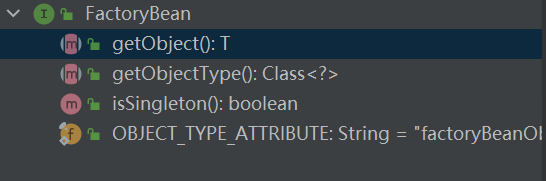

# Spring-Beans创建

## FactoryBean

BeanFactory里会使用FactoryBean来创建Bean

```java
public interface FactoryBean {
  T getObject() throws Exception;
  Class<?> getObjectType();
  default boolean isSingleton();
}
```


## BeanFactory
获取spring容器的顶级接口. 提供获取bean, 判断单例多例,获取类型功能。

```java
public interface BeanFactory {
    T getBean();
    boolean isSingleTon();
    boolean isPrototype(String name) throws NoSuchBeanDefinitionException;
    boolean isTypeMatch(String name, ResolvableType typeToMatch) throws NoSuchBeanDefinitionException;
    Class<?> getType(String name) throws NoSuchBeanDefinitionException;
}

```


The root interface for accessing a Spring bean container.
This is the basic client view of a bean container; further interfaces such as ListableBeanFactory and org.springframework.beans.factory.config.ConfigurableBeanFactory are available for specific purposes.
This interface is implemented by objects that hold a number of bean definitions, each uniquely identified by a String name. Depending on the bean definition, the factory will return either an independent instance of a contained object (the Prototype design pattern), or a single shared instance (a superior alternative to the Singleton design pattern, in which the instance is a singleton in the scope of the factory). Which type of instance will be returned depends on the bean factory configuration: the API is the same. Since Spring 2.0, further scopes are available depending on the concrete application context (e.g. "request" and "session" scopes in a web environment).
The point of this approach is that the BeanFactory is a central registry of application components, and centralizes configuration of application components (no more do individual objects need to read properties files, for example). See chapters 4 and 11 of "Expert One-on-One J2EE Design and Development" for a discussion of the benefits of this approach.
Note that it is generally better to rely on Dependency Injection ("push" configuration) to configure application objects through setters or constructors, rather than use any form of "pull" configuration like a BeanFactory lookup. Spring's Dependency Injection functionality is implemented using this BeanFactory interface and its subinterfaces.
Normally a BeanFactory will load bean definitions stored in a configuration source (such as an XML document), and use the org.springframework.beans package to configure the beans. However, an implementation could simply return Java objects it creates as necessary directly in Java code. There are no constraints on how the definitions could be stored: LDAP, RDBMS, XML, properties file, etc. Implementations are encouraged to support references amongst beans (Dependency Injection).
In contrast to the methods in ListableBeanFactory, all of the operations in this interface will also check parent factories if this is a HierarchicalBeanFactory. If a bean is not found in this factory instance, the immediate parent factory will be asked. Beans in this factory instance are supposed to override beans of the same name in any parent factory.

### spring bean生命周期
Bean factory implementations should support the standard bean lifecycle interfaces as far as possible. The full set of initialization methods and their standard order is:

BeanNameAware's setBeanName
BeanClassLoaderAware's setBeanClassLoader
BeanFactoryAware's setBeanFactory
EnvironmentAware's setEnvironment
EmbeddedValueResolverAware's setEmbeddedValueResolver
ResourceLoaderAware's setResourceLoader (only applicable when running in an application context)
ApplicationEventPublisherAware's setApplicationEventPublisher (only applicable when running in an application context)
MessageSourceAware's setMessageSource (only applicable when running in an application context)
ApplicationContextAware's setApplicationContext (only applicable when running in an application context)
ServletContextAware's setServletContext (only applicable when running in a web application context)
postProcessBeforeInitialization methods of BeanPostProcessors
InitializingBean's afterPropertiesSet
a custom init-method definition
postProcessAfterInitialization methods of BeanPostProcessors


On shutdown of a bean factory, the following lifecycle methods apply:
postProcessBeforeDestruction methods of DestructionAwareBeanPostProcessors
DisposableBean's destroy
a custom destroy-method definition

## spring三级缓存
ApplicationContextInitializer


## TypeConverter

```java

public abstract class AbstractFactoryBean<T>
        implements FactoryBean<T>, BeanClassLoaderAware, BeanFactoryAware, InitializingBean, DisposableBean {

   protected TypeConverter getBeanTypeConverter() {
    BeanFactory beanFactory = getBeanFactory();
    if (beanFactory instanceof ConfigurableBeanFactory) {
     return ((ConfigurableBeanFactory) beanFactory).getTypeConverter();
    } else {
     return new SimpleTypeConverter();
    }
   }
}
```


## FAQ
- Spring如何解决Spring创建的容器单例BeanA依赖多例的BeanB？
  实现ApplicationContextAware,通过它的getBean("B")来获取
- spring里说的bean依赖是什么？
  一个bean持有其他bean的引用

- 依赖注入体现
  - 构造方法注入(spring推荐，可以防止非空)
    - 可能造成循环依赖(action: 编辑源代码,将构造方法注入改为setter注入)
  - 属性注入(可以重新注入依赖)
  - 循环依赖问题
- 几个关键
  - beanDefination
    - 配置bean依赖
