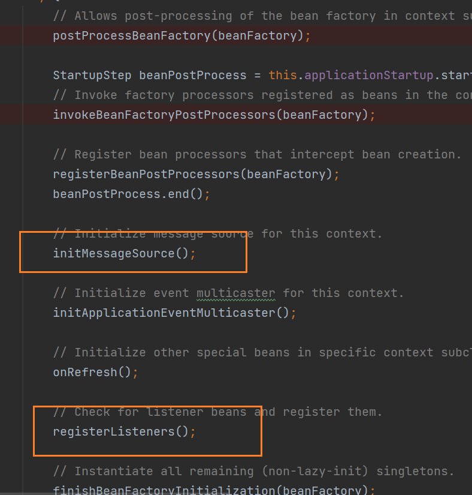

# 学习前问题
- spring源码非常多, 模块也多，应该从哪个类作为主入口来探索spring？
A: org.springframework.context.support.AbstractApplicationContext#refresh  
- spring是个容器，这个容器时用哪个类承载的？ applicationContext
- spring这个容器时存的是Bean， 这些bean是如何创建的？bean创建好了存放在哪？外面如何取?
- springboot项目里使用@Component @Serverice 这些注解，spring是如何发现及放入容器的？  
- spring这个容器创建好后，能在注册Bean吗？ 如何注册？
  - 能
  - org.springframework.beans.factory.support.DefaultListableBeanFactory.registerSingleton
  
```java
org.springframework.context.support.AbstractApplicationContext.initMessageSource
// Use empty MessageSource to be able to accept getMessage calls.
			DelegatingMessageSource dms = new DelegatingMessageSource();
			dms.setParentMessageSource(getInternalParentMessageSource());
			this.messageSource = dms;
			beanFactory.registerSingleton(MESSAGE_SOURCE_BEAN_NAME, this.messageSource);
			if (logger.isTraceEnabled()) {
				logger.trace("No '" + MESSAGE_SOURCE_BEAN_NAME + "' bean, using [" + this.messageSource + "]");
			}
```
- spring源代码的架构是怎样的？  
- spring的源码都说写NB， NB在哪里？设计模式有哪些？扩展点在哪里？  
  - 设计模式
    - 责任链模式： Event  
    - 模板方法
  - 扩展点
    - org.springframework.context.support.AbstractApplicationContext.refresh

- spring的命名很规范，对应的从命名就能看出功能的有哪些？
  - XXXAware: 提供XXX类的IOC
  - XXXProcessor： 提后XXX的处理功能
- spring哪些注解如何被spring容器发现的

# SpringBoot启动流程
com.alipay.autotuneservice.AutotuneServiceApplication#main
org.springframework.boot.SpringApplication#run(java.lang.Class<?>[], java.lang.String[])
org.springframework.boot.SpringApplication#run(java.lang.String...)
org.springframework.boot.SpringApplication#refreshContext ->
org.springframework.context.support.AbstractApplicationContext#refresh ->
org.springframework.context.support.AbstractApplicationContext#invokeBeanFactoryPostProcessors (静态方法) ->
org.springframework.context.support.PostProcessorRegistrationDelegate#invokeBeanFactoryPostProcessors(org.springframework.beans.factory.config.ConfigurableListableBeanFactory, java.util.List<org.springframework.beans.factory.config.BeanFactoryPostProcessor>) ->
org.springframework.beans.factory.support.AbstractBeanFactory#getBean(java.lang.String, java.lang.Class<T>) ->
org.springframework.beans.factory.support.AbstractBeanFactory#doGetBean ->
org.springframework.beans.factory.support.AbstractAutowireCapableBeanFactory#createBean(java.lang.String, org.springframework.beans.factory.support.RootBeanDefinition, java.lang.Object[]) ->
org.springframework.beans.factory.support.AbstractAutowireCapableBeanFactory#doCreateBean
● 实例化Bean
○ org.springframework.beans.factory.support.AbstractAutowireCapableBeanFactory#createBeanInstance
● 填充Bean的属性
○ org.springframework.beans.factory.support.AbstractAutowireCapableBeanFactory#populateBean
● 初始化Bean
○ org.springframework.beans.factory.support.AbstractAutowireCapableBeanFactory#initializeBean(java.lang.String, java.lang.Object, org.springframework.beans.factory.support.RootBeanDefinition)
■ 调用AwareMethod
● org.springframework.beans.factory.support.AbstractAutowireCapableBeanFactory#invokeAwareMethods
■ 调用bean初始化前的增强操作，获取容器中所有BeanPostProcessor接口的实例，依次调用其postProcessBeforeInitialization方法，对wrappedBean进行init之前的增强处理
● org.springframework.beans.factory.support.AbstractAutowireCapableBeanFactory#applyBeanPostProcessorsBeforeInitialization
■ 进行Bean初始化  //Bean的init过程（先调用InitializingBean的afterPropertiesSet 方法，再调用init-method指定的的方法）
● org.springframework.beans.factory.support.AbstractAutowireCapableBeanFactory#invokeInitMethods
■ 调用bean初始化后的增强操作, //获取容器中所有BeanPostProcessor接口的实例，依次调用其postProcessAfterInitialization方法，对wrappedBean进行init之后的增强处理
● org.springframework.beans.factory.support.AbstractAutowireCapableBeanFactory#applyBeanPostProcessorsAfterInitialization


关键类
BeanPostProcessor

```java
public interface BeanPostProcessor {
Object postProcessBeforeInitialization(Object bean, String beanName) throws BeansException;
Object postProcessAfterInitialization(Object bean, String beanName) throws BeansException;

}
```

//Bean的init过程（先调用InitializingBean的afterPropertiesSet
protected Object initializeBean(final String beanName, final Object bean, RootBeanDefinition mbd) {    ...     //获取容器中所有BeanPostProcessor接口的实例，依次调用其postProcessBeforeInitialization方法，对wrappedBean进行init之前的增强处理       wrappedBean = applyBeanPostProcessorsBeforeInitialization(wrappedBean, beanName);    //Bean的init过程（先调用InitializingBean的afterPropertiesSet 方法，再调用init-method指定的的方法）       invokeInitMethods(beanName, wrappedBean, mbd);   ... //获取容器中所有BeanPostProcessor接口的实例，依次调用其postProcessAfterInitialization方法，对wrappedBean进行init之后的增强处理       wrappedBean = applyBeanPostProcessorsAfterInitialization(wrappedBean, beanName);       return wrappedBean; }

BeanFactory
ApplicationContextAware
用于构建获取ApplicationContext的桥梁，
● 获取ApplicationContext
● 通过ApplicationContext获取bean
● 发布事件

```java
public interface ApplicationContextAware extends Aware {

/**
* Set the ApplicationContext that this object runs in.
* Normally this call will be used to initialize the object.
* <p>Invoked after population of normal bean properties but before an init callback such
* as {@link org.springframework.beans.factory.InitializingBean#afterPropertiesSet()}
* or a custom init-method. Invoked after {@link ResourceLoaderAware#setResourceLoader},
* {@link ApplicationEventPublisherAware#setApplicationEventPublisher} and
* {@link MessageSourceAware}, if applicable.
* @param applicationContext the ApplicationContext object to be used by this object
* @throws ApplicationContextException in case of context initialization errors
* @throws BeansException if thrown by application context methods
* @see org.springframework.beans.factory.BeanInitializationException
  */
  void setApplicationContext(ApplicationContext applicationContext) throws BeansException;

}
```

InitializingBean
用于在BeanFactory创建bean后为bean设置属性完成后，放入的一个扩展点。等同于@PostContructor
Interface to be implemented by beans that need to react once all their properties have been set by a BeanFactory: e.g. to perform custom initialization, or merely to check that all mandatory properties have been set.


```java
public interface InitializingBean {

    /**
* Invoked by the containing {@code BeanFactory} after it has set all bean properties
* and satisfied {@link BeanFactoryAware}, {@code ApplicationContextAware} etc.
* <p>This method allows the bean instance to perform validation of its overall
* configuration and final initialization when all bean properties have been set.
* @throws Exception in the event of misconfiguration (such as failure to set an
* essential property) or if initialization fails for any other reason
  */
  void afterPropertiesSet() throws Exception;
  }
```
  

org.springframework.beans.factory.config.BeanPostProcessor#postProcessBeforeInitialization
BeanDefinition
作用：
A BeanDefinition describes a bean instance, which has property values, constructor argument values, and further information supplied by concrete implementations.
This is just a minimal interface: The main intention is to allow a BeanFactoryPostProcessor to introspect and modify property values and other bean metadata.
BeanDefinition本身描述的是一个bean示例信息，如property值，参数值，etc，为BeanFactoryPostProcessor在检查和修改Bean元数据信息用.


ConfigurableListableBeanFactory


