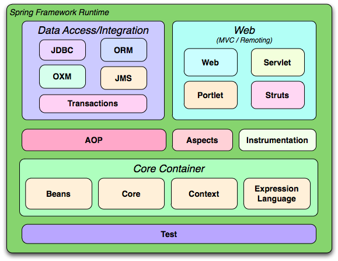

# Spring架构


# Spring 设计哲学
Design Philosophy
When you learn about a framework, it’s important to know not only what it does but what principles it follows. Here are the guiding principles of the Spring Framework:

### Provide choice at every level.  在每一层都提供选择
Spring lets you defer design decisions as late as possible. For example, you can switch persistence providers through configuration without changing your code. The same is true for many other infrastructure concerns and integration with third-party APIs.

### Accommodate diverse perspectives. 适应各种需求
 Spring embraces flexibility and is not opinionated about how things should be done. It supports a wide range of application needs with different perspectives.
 Accommodate　常用词汇
 英 [ə'kɒmədeɪt] 　 　 美 [ə'kɑːmədeɪt]
 vt. 供给住宿；使适应；容纳；提供；顾及；调解
 vi. 适应；调节
### Maintain strong backward compatibility. 
Spring’s evolution has been carefully managed to force few breaking changes between versions. Spring supports a carefully chosen range of JDK versions and third-party libraries to facilitate maintenance of applications and libraries that depend on Spring.

### Care about API design. 
The Spring team puts a lot of thought and time into making APIs that are intuitive and that hold up across many versions and many years.

### Set high standards for code quality. 
The Spring Framework puts a strong emphasis on meaningful, current, and accurate javadoc. It is one of very few projects that can claim clean code structure with no circular dependencies between packages.


# spring框架学习路线
springboot使用spring, 借助springboot启动来学习。


SpringBoot::SpringApplication#run -> refreshContext() -> spring::ConfigurableApplicationContext#refresh()
```java
private void refreshContext(ConfigurableApplicationContext context) {
		if (this.registerShutdownHook) {
			shutdownHook.registerApplicationContext(context);
		}
		refresh(context);
	}

protected void refresh(ConfigurableApplicationContext applicationContext) {
        applicationContext.refresh();
        }    
```

# Spring-Beans创建


## BeanFactory
获取spring容器的顶级接口. 提供获取bean, 判断单例多例,获取类型功能。

The root interface for accessing a Spring bean container.
This is the basic client view of a bean container; further interfaces such as ListableBeanFactory and org.springframework.beans.factory.config.ConfigurableBeanFactory are available for specific purposes.
This interface is implemented by objects that hold a number of bean definitions, each uniquely identified by a String name. Depending on the bean definition, the factory will return either an independent instance of a contained object (the Prototype design pattern), or a single shared instance (a superior alternative to the Singleton design pattern, in which the instance is a singleton in the scope of the factory). Which type of instance will be returned depends on the bean factory configuration: the API is the same. Since Spring 2.0, further scopes are available depending on the concrete application context (e.g. "request" and "session" scopes in a web environment).
The point of this approach is that the BeanFactory is a central registry of application components, and centralizes configuration of application components (no more do individual objects need to read properties files, for example). See chapters 4 and 11 of "Expert One-on-One J2EE Design and Development" for a discussion of the benefits of this approach.
Note that it is generally better to rely on Dependency Injection ("push" configuration) to configure application objects through setters or constructors, rather than use any form of "pull" configuration like a BeanFactory lookup. Spring's Dependency Injection functionality is implemented using this BeanFactory interface and its subinterfaces.
Normally a BeanFactory will load bean definitions stored in a configuration source (such as an XML document), and use the org.springframework.beans package to configure the beans. However, an implementation could simply return Java objects it creates as necessary directly in Java code. There are no constraints on how the definitions could be stored: LDAP, RDBMS, XML, properties file, etc. Implementations are encouraged to support references amongst beans (Dependency Injection).
In contrast to the methods in ListableBeanFactory, all of the operations in this interface will also check parent factories if this is a HierarchicalBeanFactory. If a bean is not found in this factory instance, the immediate parent factory will be asked. Beans in this factory instance are supposed to override beans of the same name in any parent factory.

### spring bean生命周期
Bean factory implementations should support the standard bean lifecycle interfaces as far as possible. The full set of initialization methods and their standard order is:

BeanNameAware's setBeanName
BeanClassLoaderAware's setBeanClassLoader
BeanFactoryAware's setBeanFactory
EnvironmentAware's setEnvironment
EmbeddedValueResolverAware's setEmbeddedValueResolver
ResourceLoaderAware's setResourceLoader (only applicable when running in an application context)
ApplicationEventPublisherAware's setApplicationEventPublisher (only applicable when running in an application context)
MessageSourceAware's setMessageSource (only applicable when running in an application context)
ApplicationContextAware's setApplicationContext (only applicable when running in an application context)
ServletContextAware's setServletContext (only applicable when running in a web application context)
postProcessBeforeInitialization methods of BeanPostProcessors
InitializingBean's afterPropertiesSet
a custom init-method definition
postProcessAfterInitialization methods of BeanPostProcessors


On shutdown of a bean factory, the following lifecycle methods apply:
postProcessBeforeDestruction methods of DestructionAwareBeanPostProcessors
DisposableBean's destroy
a custom destroy-method definition


```java
public interface BeanFactory {
    T getBean();
    boolean isSingleTon();
    boolean isPrototype(String name) throws NoSuchBeanDefinitionException;
    boolean isTypeMatch(String name, ResolvableType typeToMatch) throws NoSuchBeanDefinitionException;
    Class<?> getType(String name) throws NoSuchBeanDefinitionException;
}

```

## TypeConverter

```java

public abstract class AbstractFactoryBean<T>
        implements FactoryBean<T>, BeanClassLoaderAware, BeanFactoryAware, InitializingBean, DisposableBean {

   protected TypeConverter getBeanTypeConverter() {
    BeanFactory beanFactory = getBeanFactory();
    if (beanFactory instanceof ConfigurableBeanFactory) {
     return ((ConfigurableBeanFactory) beanFactory).getTypeConverter();
    } else {
     return new SimpleTypeConverter();
    }
   }
}
```

## spring启动原理
SpringApplication#run
```java
// spring boot启动原理
@SpringBootApplication()
public class AutotuneServiceApplication {

    public static void main(String[] args) {
        SpringApplication.run(AutotuneServiceApplication.class, args);
    }

}
```


## Spring源码里的命名习惯
AWare是一个标志接口,实现该接口的类能被spring容器以callback回调来通知。

A marker superinterface indicating that a bean is eligible to be notified 
by the Spring container of a particular framework object through a callback-style method. 
The actual method signature is determined by individual subinterfaces 
but should typically consist of just one void-returning method that accepts a single argument.
Note that merely implementing Aware provides no default functionality. 
Rather, processing must be done explicitly, 
for example in a org.springframework.beans.factory.config.BeanPostProcessor.
Refer to org.springframework.context.support.ApplicationContextAwareProcessor for an example of processing specific *Aware interface callbacks.
```java

public interface Aware {

}
```
### XXXAware
代表XXX装配中心, DI提供XXX类。实现者可通过该类获取XXX。是spring提供的一个扩展点。   

缺点： 使得code与spring API耦合了, 未遵循spring IOC风格

- ApplicationContextAware提供ApplicationContext
```java
public interface ApplicationContextAware extends Aware {
    void setApplicationContext(ApplicationContext applicationContext) throws BeansException;
}
```

- BeanFactoryAware提供BeanFactory
```java
public interface BeanFactoryAware extends Aware {
	void setBeanFactory(BeanFactory beanFactory) throws BeansException;
}
```
- ApplicationEventPublisherAware提供ApplicationEventPublisher
```java 

public interface ApplicationEventPublisherAware extends Aware {

	/**
	 * Set the ApplicationEventPublisher that this object runs in.
	 * <p>Invoked after population of normal bean properties but before an init
	 * callback like InitializingBean's afterPropertiesSet or a custom init-method.
	 * Invoked before ApplicationContextAware's setApplicationContext.
	 * @param applicationEventPublisher event publisher to be used by this object
	 */
	void setApplicationEventPublisher(ApplicationEventPublisher applicationEventPublisher);

}
```

FactoryBean与BeanFactory